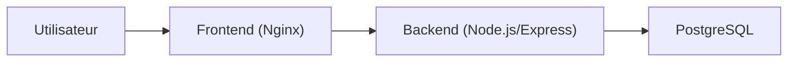

# VitalSync - CI/CD Conteneurise

## 1. Description
VitalSync est une application minimaliste de suivi medical et sportif.
L'objectif est de demonstrer une chaine DevOps complete avec:
- gestion Git avec workflow de branches
- conteneurisation Docker
- pipeline CI/CD
- orchestration Kubernetes

## 2. Architecture
- `backend` (Node.js/Express) expose une API sur `:3000`
- `frontend` (Nginx + page statique) expose l'interface sur `:8080` en local
- `database` (PostgreSQL) est isolee dans le reseau Docker



## 3. Prerequis
- Docker >= 24
- Docker Compose >= 2
- Git >= 2.40
- Node.js 20 (pour execution locale hors conteneur)

## 4. Lancement local avec Docker Compose
```bash
cp .env.example .env
docker compose up --build -d
docker ps
```

Verification:
- Frontend: http://localhost:8080
- API health: http://localhost:3000/health

Arret:
```bash
docker compose down
```

Arret + purge volumes:
```bash
docker compose down -v
```

## 5. Pipeline CI/CD
Le workflow GitHub Actions (`.github/workflows/ci-cd.yml`) fait:
1. Lint + tests Jest du backend.
2. Build des images Docker backend/frontend.
3. Tag des images avec le SHA du commit.
4. Push vers GHCR.
5. Deploiement staging (simulation) et health check HTTP.

La pipeline echoue automatiquement si:
- lint ou tests echouent
- build/push Docker echoue
- health check final ne repond pas correctement

## 6. Choix techniques et justifications
- `node:20-alpine`: image plus legere et surface d'attaque reduite.
- Multi-stage build: outils de test absents de l'image runtime.
- Reseau Docker dedie: isolation et nommage de services simplifie.
- Volume PostgreSQL: persistance des donnees meme apres recreation des conteneurs.
- Tag Docker par SHA: tracabilite precise, rollback fiable.
- Ingress Kubernetes: routage HTTP centralise et extensible.

## 7. Variables d'environnement
Variables definies dans `.env.example`:
- `POSTGRES_DB`, `POSTGRES_USER`, `POSTGRES_PASSWORD`
- `DB_HOST`, `DB_PORT`, `DB_NAME`, `DB_USER`, `DB_PASSWORD`
- `PORT`

Les secrets ne doivent jamais etre commits dans le depot.

## 8. Strategie Git
Le projet suit Gitflow avec les branches `main`, `develop` et des branches `feature/*`.
Les commits suivent Conventional Commits pour clarifier l'historique et simplifier la revue.
